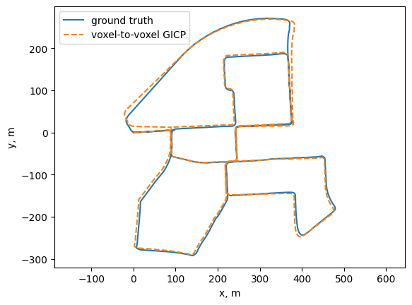
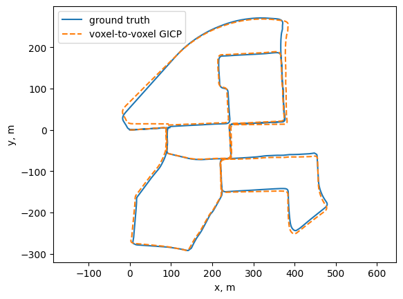
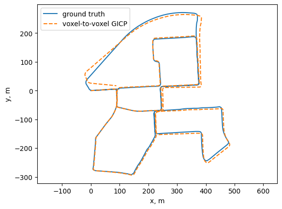
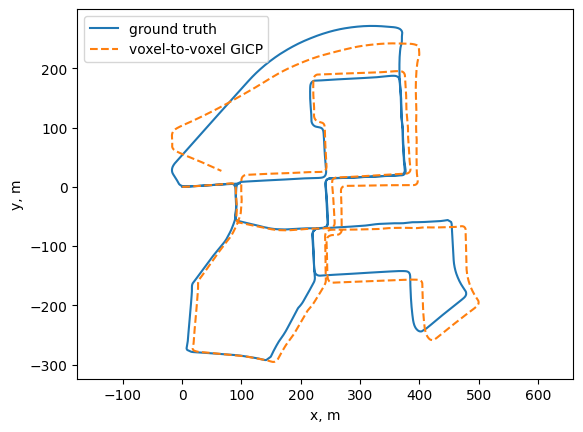

# Voxel-to-Voxel GICP

This repository modifies the approach and implementation in [koide3/fast_gicp](https://github.com/koide3/fast_gicp) to implement voxel-to-voxel generalized ICP for LiDAR odometry. The proposed approach is described in [our paper on IEEE Xplore](https://ieeexplore.ieee.org/document/11549887).

The C++ implementation is `fast_gicp::FastSVGICP`, exposed to Python as `pygicp.FastSVGICP`. This repository also includes `FastGICP` and `FastVGICP` for comparison. Registration classes use the PCL registration interface.

## Build

You need a C++ compiler, CMake (3.10 or newer), PCL, and Eigen3. OpenMP enables multithreading; without it, the library runs with one thread. Python bindings additionally require Python, setuptools, and pybind11.

### Ubuntu / Debian

Install dependencies and clone this repository:

```bash
sudo apt update
sudo apt install build-essential cmake libpcl-dev libeigen3-dev \
    python3-dev python3-venv pybind11-dev
git clone https://github.com/igo320345/voxel-to-voxel_gicp.git
cd voxel-to-voxel_gicp
```

Build the C++ shared library:

```bash
cmake -S . -B build -DCMAKE_BUILD_TYPE=Release
cmake --build build --parallel 8
```

### Python bindings and evaluation dependencies

From the repository root, create an environment and build the extension and shared library together:

```bash
python3 -m venv .venv
source .venv/bin/activate
python -m pip install --upgrade pip setuptools wheel
python -m pip install pybind11 numpy matplotlib jupyterlab ipykernel
export pybind11_DIR="$(python -m pybind11 --cmakedir)"
cmake -S . -B build/python -DCMAKE_BUILD_TYPE=Release \
    -DBUILD_PYTHON_BINDINGS=ON -DPYTHON_EXECUTABLE="$(command -v python)" \
    -Dpybind11_DIR="$pybind11_DIR"
cmake --build build/python --parallel 8
export PYTHONPATH="$PWD/build/python${PYTHONPATH:+:$PYTHONPATH}"
python -c "import pygicp; print(pygicp.FastSVGICP())"
python -m ipykernel install --user --name voxel-gicp --display-name "Voxel-to-Voxel GICP"
```

Keep this shell open for evaluation: `PYTHONPATH` makes the extension in `build/python/` importable when working in `src/`. The CMake build puts the `fast_gicp` shared library beside the extension, where its runtime loader can find it.

### macOS

Install native dependencies with Homebrew, then follow the Python steps above:

```bash
brew install cmake pcl eigen libomp
```

For the Python CMake configuration above, also pass `-DCMAKE_PREFIX_PATH="$(brew --prefix libomp)"`. For a standalone C++ build, make OpenMP discoverable with:

```bash
cmake -S . -B build -DCMAKE_BUILD_TYPE=Release \
    -DCMAKE_PREFIX_PATH="$(brew --prefix libomp)"
cmake --build build --parallel 8
```

Check CMake's output for OpenMP detection when measuring multithreaded performance.

## Evaluate on KITTI odometry

### Prepare the dataset

Download the **velodyne laser data**, **calibration files**, and **ground truth poses** from the [KITTI odometry benchmark](https://www.cvlibs.net/datasets/kitti/eval_odometry.php). Extract them into a common directory with this layout:

```text
kitti_odometry/
├── sequences/
│   ├── 00/
│   │   ├── calib.txt
│   │   └── velodyne/
│   │       ├── 000000.bin
│   │       ├── 000001.bin
│   │       └── ...
│   └── ...
└── poses/
    ├── 00.txt
    └── ...
```

Use sequences `00`–`10`, which have public ground truth. This evaluation loader requires a pose file; sequences `11`–`21` cannot be evaluated with it using the public downloads. Images are unnecessary.

### Run the notebook

From the same activated shell used to build the Python extension:

```bash
cd src
python -m jupyterlab kitti_eval.ipynb
```

Select the **Voxel-to-Voxel GICP** kernel. Replace the absolute dataset path in each `KittiOdometrySequence(...)` call with your dataset root. The saved runs all use sequence `00`; update the sequence in every registration cell when evaluating another sequence.

Run the import cell, then the registration cells you want to evaluate. Each run prints average FPS and drift metrics and plots estimated and ground-truth trajectories. To compare algorithms, use the same sequence, downsampling resolution, thread count, and voxel resolution (where applicable).

### Run without Jupyter

From `src/`, run the following in Python, substituting your dataset path:

```python
import pygicp
from kitti_dataset import KittiOdometrySequence
from evaluation_helper import evaluate_and_plot

dataset = KittiOdometrySequence("/path/to/kitti_odometry", "00")
reg = pygicp.FastSVGICP()
reg.set_num_threads(0)  # Use the OpenMP maximum; use a positive value to fix it.
reg.set_resolution(1.0)  # Registration voxel size, in meters.

result = evaluate_and_plot(
    reg,
    dataset,
    downsample_resolution=0.5,  # Meters; 0.0 disables input downsampling.
    plot_title="KITTI 00 - voxel-to-voxel GICP",
)
```

Use `pygicp.FastGICP()` or `pygicp.FastVGICP()` for the baselines; `FastGICP` has no `set_resolution` method. The helper performs scan-to-scan odometry, reuses the previous relative transform as the next initial guess, and accumulates poses. It converts ground truth to the Velodyne frame and expresses both trajectories relative to the first pose.

For a shorter run, pass `frame_range=range(0, 500)` to the dataset constructor. Start at frame zero and keep frames consecutive: the current helper assumes that indexing. Short trajectories may have no samples for longer evaluation segments.

### Metrics

[evaluation_helper.py](src/evaluation_helper.py) measures translation drift as a percentage of segment length and rotation drift in degrees per meter over segments of 100, 200, …, 800 meters. Lower drift is better. The overall values average all valid segment samples, so lengths with more samples contribute more.

These are local KITTI-style metrics, not official benchmark submissions: this evaluator samples every starting frame, uses the first endpoint at or beyond the requested distance, and computes relative pose error as `inv(T_gt_rel) @ T_est_rel`. Its sampling and error convention differ from the official evaluator. Average FPS is the mean of rolling ten-timestamp FPS estimates during the odometry loop, including scan loading and downsampling; it is not isolated registration throughput.

## Saved notebook results

The following values and plots come directly from the stored outputs in [kitti_eval.ipynb](src/kitti_eval.ipynb). They have not been rerun for this README. Hardware and software versions are not recorded in the notebook, so FPS should be treated as a record of those runs. All runs use `set_num_threads(0)`; voxel-based methods use 1.0 m registration voxels.

| Sequence | Method | Input downsampling (m) | Average FPS | Translation drift (%) | Rotation drift (deg/m) | Segment samples |
| --- | --- | ---: | ---: | ---: | ---: | ---: |
| 00 | GICP | 0.5 | 77.414 | 1.332 | 0.007694 | 32,789 |
| 00 | VGICP | 0.5 | 94.168 | 1.004 | 0.004639 | 32,789 |
| 00 | Voxel-to-voxel GICP | 0.5 | 99.844 | 1.258 | 0.007452 | 32,789 |
| 00 | Voxel-to-voxel GICP | Disabled | 16.277 | 3.772 | 0.016937 | 32,789 |

The three runs with 0.5 m input downsampling use the same sequence and downsampling settings. The run without input downsampling uses a different configuration and is shown separately for context.

### Sequence 00: GICP, 0.5 m downsampling



### Sequence 00: VGICP, 0.5 m downsampling



### Sequence 00: voxel-to-voxel GICP, 0.5 m downsampling



### Sequence 00: voxel-to-voxel GICP, no input downsampling



The images preserve the notebook outputs. Its shared plotting helper labels every estimated curve “voxel-to-voxel GICP,” including baseline runs; the headings above identify the actual method.

## References

- Original implementation and approach: [koide3/fast_gicp](https://github.com/koide3/fast_gicp).
- Proposed voxel-to-voxel approach: [paper on IEEE Xplore](https://ieeexplore.ieee.org/document/11549887).
- Dataset: [KITTI odometry benchmark](https://www.cvlibs.net/datasets/kitti/eval_odometry.php).
